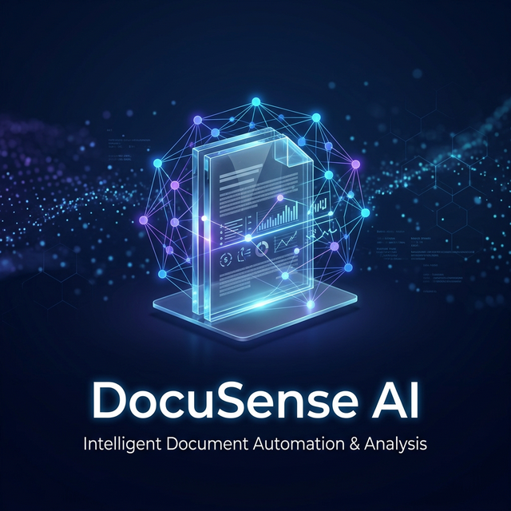
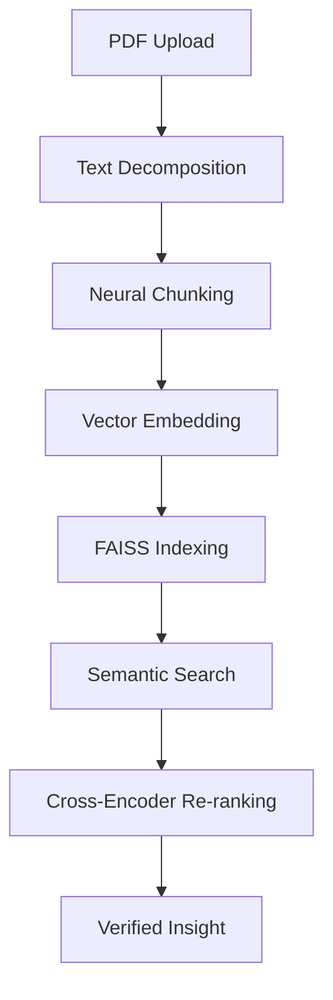

#  DocuSense AI 🪄 | Semantic Document Intelligence



> **Experience the future of document interaction.**  
> DocuSense AI is a premium, high-accuracy semantic search engine that deconstructs PDF documents into a neural vector space, allowing you to query insights with conversational precision.

---

## ⚡ Core Capabilities

- **🧠 Neural Semantic Analysis**: Uses `Sentence-Transformers` to map document hierarchy into high-dimensional vector representations.
- **⚡ FAISS Acceleration**: Powered by Meta's `FAISS` for lightning-fast similarity retrieval across massive text corpora.
- **🔍 Dual-Stage Re-ranking**: Implements a `Cross-Encoder` (`ms-marco-MiniLM-L-6-v2`) to re-score hits, ensuring the top result is always the most contextually relevant.
- **✨ Premium Glassmorphism UI**: A state-of-the-art Streamlit interface featuring splash screens, data visualization, and micro-animations for an elite user experience.

---

## 🛠️ Technology Stack

| Component | Technology |
| :--- | :--- |
| **Framework** | Streamlit (Python) |
| **Vector Engine** | Meta FAISS (Intel-Optimized) |
| **Embeddings** | Sentence-Transformers (all-MiniLM-L6-v2) |
| **Re-ranker** | Cross-Encoder (MS-Marco) |
| **Processing** | Regex Sanitization & Chunking |

---

## 🚀 Quick Start

### 1. Prerequisites
Ensure you have Python 3.9+ installed and a virtual environment active.

### 2. Installation
```bash
# Clone the repository
git clone https://github.com/vijayrajeshr/DocuSense-AI.git
cd DocuSense-AI

# Install dependencies
pip install -r requirements.txt
```

### 3. Launching the Engine
```bash
streamlit run app.py
```

---

## 📜 Professional Workflow

1. **Neural Sync**: Upon launch, the engine completes a 3-second system synchronization.
2. **Deconstruction**: Upload any PDF. The engine performs lexical analysis and geometry extraction.
3. **Vectorization**: Sentences are normalized and transformed into dense vectors.
4. **Querying**: Input conversational questions. The engine performs a multi-stage search and provides "Verified Insights" with a confidence score.

---

## 📂 Architecture Overview



---

## 🛡️ Security & Privacy
DocuSense AI processes all data locally within your current session. No document text or vector weights are transmitted to external servers, ensuring **100% data sovereignty**.

---

<p align="center">
  <b>Built for precision. Designed for the elite.</b><br>
  <i>DocuSense AI — Where documents find their voice.</i>
</p>